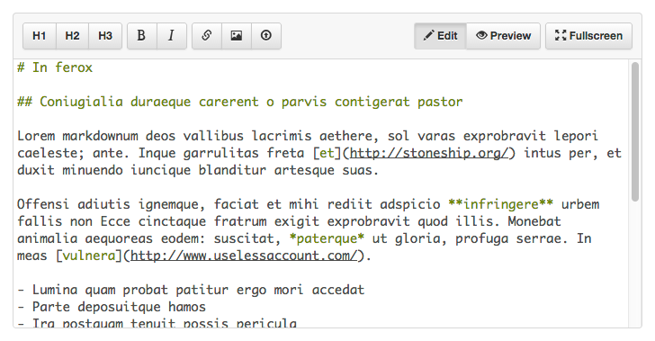

# Bootstrap Markdown Editor

Markdown editor for Bootstrap with preview, image upload support, shortcuts and other features.
This is a jQuery plugin.

## Requirements

* Bootstrap 3
* jQuery
* Ace editor (http://ace.c9.io)

## Features

* Preview support
* Image upload support (drag and drop & button)
* Shortcuts
* Multiples instances on the same page
* Fullscreen
* Themes
* i18n

## Screenshot



## Basic Usage

Include the CSS files of Bootstrap and Bootstrap Markdown Editor:

```html
<link href="bower_components/bootstrap/dist/css/bootstrap.min.css" rel="stylesheet">
<link href="dist/css/bootstrap-markdown-editor.css" rel="stylesheet">
```

Include the scripts of jQuery, Ace and Bootstrap Markdown Editor.
Optionally, include the script of Bootstrap to enable tooltips:

```html
<script src="bower_components/jquery/dist/jquery.min.js"></script>
<script src="bower_components/bootstrap/dist/js/bootstrap.min.js"></script>
<script src="bower_components/ace-builds/src-min/ace.js"></script>
<script src="dist/js/bootstrap-markdown-editor.js"></script>
```

Create a div for the editor:

```html
<div id="myEditor"># Test</div>
```

Initialize the editor:

```javascript
$('#myEditor').markdownEditor();
```

To get the content in any moment:

```javascript
$('#myEditor').markdownEditor('content');
```

## Implementing the preview

You have to implement the parsing of the Markdown.
Bootstrap Markdown Editor provides you a callback where you have to parse the markdown and return the html.
To activate the preview you have to use the following options:

```javascript
$('#myEditor').markdownEditor({
  // Activate the preview:
  preview: true,
  // This callback is called when the user click on the preview button:
  onPreview: function (content, callback) {
  
    // Example of implementation with ajax:
    $.ajax({
      url: 'preview.php',
      type: 'POST',
      dataType: 'html',
      data: {content: content},
    })
    .done(function(result) {
      // Return the html:
      callback(result);
    });

  }
});
```

## Implementing the image upload

You have to implement the server side part of the upload process.
To activate the image uploads you have to use the following options:

```javascript
$('#myEditor').markdownEditor({
  imageUpload: true, // Activate the option
  uploadPath: 'upload.php' // Path of the server side script that receive the files
});
```

In your server side script you have to return an array of the **public path** of the successfully uploaded images in json format.
Example in PHP:

```php
$uploadedFiles = array();

if (! empty($_FILES)) {
  foreach ($_FILES as $file) {
    if (superAwesomeUploadFunction($file)) {
      $uploadedFiles[] = '/img/' . urlencode($file['name']);
    }
  }
}

echo json_encode($uploadedFiles);
```
